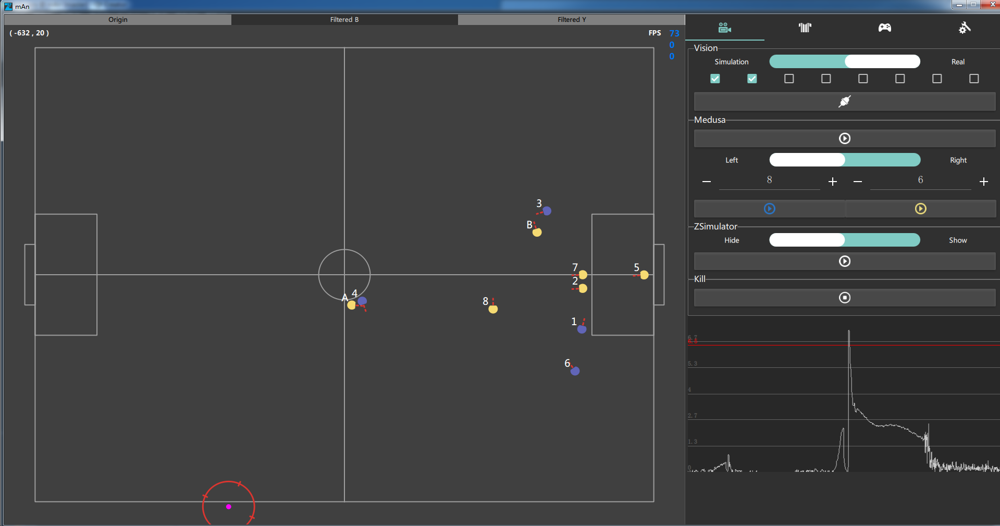

# mAn (鳗 - Mán - eel)

In ancient China, Mán(eel) is also called 赤鱬(Red giant salamander with a human face). 

> 《山海经·南山经》：“青丘之山……英水出焉，南流注于即翼之泽。其中多**赤鱬**，其状如鱼而人面，其音如鸳鸯，食之不疥。”
>
>  《The Classic of Mountains and Sees Volume One》: "A mountain called *Qingqiu*...There is also a river which flows out of this mountain and is called the *Yingshui River*.  With its water flowing swiftly to the south, it finally empties itself into the *Jiyi* Lake where there are many **red giant salamanders**. They look like a fish, but they have a human face. They make a sound like those of mandarin ducks. Whoever eats it, he will not suffer from scabies."

---

mAn is the main GUI of ZJUNlict. It also processes the vision and referee information (protobuf message).

## Software Requirement

- protobuf 3.0+
- Qt 5.10.1+
- zlib 1.2.11+
- Eigen 3
- g++ 7.4.0+(Linux) / Visual Studio 2015(Windows)

This program is tested both on Windows 7/10 i386/amd64 and Ubuntu 18.04 LTS. It is compiled with Visual Studio 2015 on Windows and with g++ on Ubuntu.

## Build

for Windows:

1. `mkdir 3rdParty ` in directory.
2. Put Protobuf lib in it. With the lib ordered like `3rdParty/protobuf/lib/x64/libprotobuf.lib` `3rdParty/protobuf/lib/x64/libprotobufd.lib` `3rdParty/protobuf/lib/x86/libprotobuf.lib` `3rdParty/protobuf/lib/x86/libprotobufd.lib`. Also put the protobuf include folder in `3rdParty/protobuf/include`
3. Put Zlib lib in it. With the lib ordered like `3rdParty/zlib/lib/x64/libprotobuf.lib` `3rdParty/zlib/lib/x64/libprotobufd.lib` `3rdParty/zlib/lib/x86/libprotobuf.lib` `3rdParty/zlib/lib/x86/libprotobufd.lib`. Also put the zlib include folder in `3rdParty/zlib/include`
4. Put Eigen folder in `3rdParty/Eigen`.
5. Run `share/proto/auto.sh`, make sure setting `protoc.exe` in system path.
6. Open the project in qt to compile.

 If you have any questions while compiling, feel free to contact us at zjunlict.ssl@gmail.com.

## Features

The GUI window is mainly occupied by the live field information. It can both receive the [grSim](https://github.com/RoboCup-SSL/grSim) message and real field message.

The right side of GUI is the control panel.  It contains four panels:

- First Panel: It can switch between simulation  (default port 10020)  and real field (default port 10005). The following eight tick buttons refer to eight cameras, as number 1 to 8. A camera is ticked means software **must** receive vision message from that camera. (A camera message will still be shown even it is not ticked ).  After been set, click connect button to connect vision. ZSimulator button is planned to link grSim (But you must compile grSim by yourself). The bottom diagram is a live ball speed diagram.
- Second Panel:  This panel contains a build-in game-controller. It can send SSL standard referee command on the default port 10003. Press start button to activate the controller.
- Third Panel: It mainly contains the built-in game recorder and log player. The rec button is started by default. The default path is bin/LOG.(make a LOG folder when necessary) The RecPlayer line can replay the file just recorded by mAn, and the Log line can play the SSL standard game log.
- Fourth Panel: Many params can be changed in the config panel. Such as vision port and referee port(under AlertPorts/).

## Refer 

More technical details in mAn, please refer [the following paper](https://arxiv.org/abs/1905.09157):

> Huang, Zheyuan, et al. "ZJUNlict Extended Team Description Paper for RoboCup 2019." *arXiv preprint arXiv:1905.09157*(2019).
